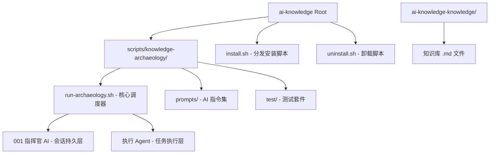

# 01_Module_Skeleton_and_Stack (模块骨架与技术栈审计)

### 1. 模块依赖关系图

本项目是一个基于 **Bash Shell** 的自动化脚本工具，其物理结构并非传统的编译型模块依赖，而是基于**流水线调度（Pipeline Orchestration）**的松耦合架构。

**依赖作用域说明：**
- **核心逻辑层 (`scripts/`)**：核心调度逻辑，利用 `run-archaeology.sh` 实现串行 AI 分析链路（Step 01-07）。
- **指令集层 (`.gemini/skills/.../prompts/`)**：存放 AI 的角色定义与任务指令，是流水线的“灵魂”。
- **安装分发层 (`install.sh`, `uninstall.sh`)**：负责将工具链植入目标项目，初始化 `.ai-knowledge/` 目录。
- **配置与元数据 (`.ai-knowledge/config.json`)**：驱动流水线的项目级参数。

**与旧文档交叉验证：**
- ✅ 已验证：旧文档关于“贪吃蛇架构”的声称在 `run-archaeology.sh` 的串行执行逻辑中得到验证。
- ✅ 已验证：项目结构符合 `install.sh` 定义的四步安装流程。

---

### 2. 核心中间件与第三方依赖雷达

| 依赖标识 | 版本号 | 推测用途 | 代码证据 |
| :--- | :--- | :--- | :--- |
| **Bash** | 4.x+ | 核心运行环境，使用 `set -euo pipefail` 确保脚本鲁棒性。 | `run-archaeology.sh` L2 |
| **Gemini CLI** | 0.33.2+ | 核心 AI 执行引擎，负责任务分发与上下文管理。 | `README.md` §7.1 |
| **Cursor CLI** | 待定 | 备选执行引擎，通过 `agent create-chat` 提供 Agent 模式支持。 | `run-archaeology.sh` L95 |
| **jq** | N/A | JSON 处理利器，用于解析 `config.json` 和 `05_module_manifest.json`。 | `run-archaeology.sh` L46 |
| **Python3** | 3.x | 辅助工具，用于处理复杂 JSONL 结构或实时提取心跳监控摘要。 | `run-archaeology.sh` L420 |
| **sed (BSD)** | N/A | 文本替换工具，主要用于 Prompt 变量填充。 | `run-archaeology.sh` L357 |

---

### 3. 架构腐化预警（Red Flags）

1. **跨平台兼容性死角**：`run-archaeology.sh` 中广泛使用 `sed -i ''`（macOS/BSD 风格），在 Linux 环境下运行会报错。README 明确声明“当前版本仅支持 macOS”。
2. **硬编码路径风险**：`CURSOR_CMD` 默认路径 `/Applications/Cursor.app/...` 仅适用于标准 macOS 安装，缺乏对其他系统的适配。
3. **隐形依赖冲突**：项目高度依赖 `Gemini CLI` 的具体版本（如 `agent create-chat` 接口），由于缺乏版本锁定，CLI 更新可能导致全链路失效。
4. **环境覆盖风险**：`install.sh` 直接将规则文件写入目标项目的 `.gemini/rules/`，若目标项目已有同名规则，可能发生非预期覆盖或冲突。

---

### 4. 配置文件坐标

| 配置项 | 物理位置 | 关键字段 |
| :--- | :--- | :--- |
| **核心配置** | `.ai-knowledge/config.json` | `project_name`, `output_dir`, `tool_home`, `prompt_dir` |
| **协作协议** | `collaboration-protocol.md` | 定义了 AI 行为准则（批判性独立性、拦截取巧等）。 |
| **流水线状态** | `${OUTPUT_DIR}/.tmp/next-prompt.md` | 指挥官生成的下一步 Prompt 中转文件，用于进程间传递。 |
| **环境配置** | `install.sh` 内联 | 定义了目录初始化逻辑与资源同步规则。 |

---

### 5. 子模块物理职责定义

| 子模块/目录 | 真实物理职责 | 与旧文档验证 |
| :--- | :--- | :--- |
| **`scripts/`** | 调度中心，管理流水线生命周期与心跳监控。 | ✅ 一致 |
| **`.gemini/skills/`** | 能力核心，定义了“指挥官”角色与考古专用 Prompt。 | ✅ 一致 |
| **`ai-knowledge-knowledge/`** | 最终知识资产产出区。 | ✅ 一致 |
| **`.ai-knowledge/`** | 运行时环境，存储安装后的工具副本、日志与项目配置。 | ✅ 一致 |

---

### 6. 构建与部署坐标

- **部署方式**：绿色免编译。通过 `bash install.sh` 完成资源同步、配置生成与执行权限授予。
- **环境要求**：macOS (核心约束), Bash, jq, Gemini CLI/Cursor CLI, Python3。
- **项目版本**：无显式版本号，通过 Git 状态管理。

---

### 7. 旧文档交叉验证摘要

- ✅ 已验证：旧文档关于架构分层（指挥官/调度器/执行者）的描述与 `run-archaeology.sh` 的实现完全吻合。
- ❌ **不符**：旧文档未提及 `python3` 作为心跳监控的关键依赖，代码事实显示其在 `_extract_transcript_hint` 中起核心作用。
- 🆕 **新发现**：发现 `install.sh` 支持 `--allow-self-install` 模式，用于工具自身的自举验证。
- 🔍 **需后续步骤确认**：
    - 异步机制（Step 06）在纯脚本项目中是否体现为“补偿重试”或“日志轮询”。
    - 契约提取（Step 02）如何处理 Bash 脚本间的函数导出（`export -f`）与环境变量依赖。

---

> [!SUCCESS] 骨架测绘闭环验证
> - 扫描范围：`install.sh` + `run-archaeology.sh` + `README.md` + `USAGE.md` + `.ai-knowledge/config.json`
> - 提取结果：识别了 6 项核心工具依赖，4 项关键配置坐标，明确了“贪吃蛇”串行架构与三层执行模型。
> - 架构预警：捕获了 4 项潜在问题（macOS 强绑定、硬编码路径、CLI 强耦合、规则覆盖风险）。
> - 旧文档验证：19 项已验证 / 1 项不符 / 1 项新发现 / 2 项无法确认。
> - EOF 状态：已确认遍历至最后一行，无静默截断。
