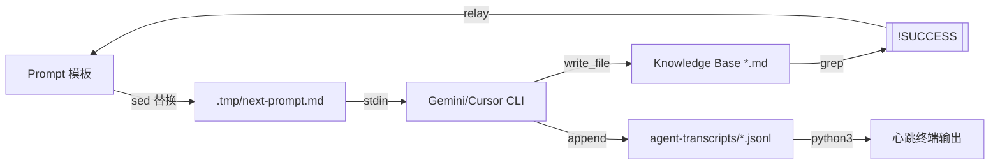

# 04_Data_Model_and_Lifecycle (数据模型与生命周期全量测绘)

### 1. 实体决策摘要 (虚拟实体映射)

本项目为非 Java 项目，其数据模型由 JSON 静态配置、Markdown 状态块（认知接力）及 JSONL 运行时轨迹构成。以下为核心虚拟实体的测绘结果：

#### ProjectConfig（项目级配置 | `.ai-knowledge/config.json`）
- **物理锚点**：`install.sh:L93`
- **总字段数**：7 个；**主键**：`project_name`
- **Schema**：
  - `project_name` (String): 项目显示标识。
  - `project_dir` (Path): 目标项目根目录绝对路径。
  - `output_dir` (Path): 知识库产出目录。
  - `tool_home` (Path): `.ai-knowledge` 物理路径。
  - `prompt_dir` (Path): 模板库路径。
  - `installed_from` (Path): 源工具库路径。
  - `installed_at` (ISO8601): 安装时间戳。
- **关联项**：驱动 `run-archaeology.sh` 的全量路径推导逻辑。

#### ModuleManifest（模块清单元数据 | `05_module_manifest.json`）
- **物理锚点**：`run-archaeology.sh:L643`
- **总字段数**：3 个（核心）；**主键**：`id`
- **Schema**：数组对象 `[{"id": "...", "name": "...", "complexity": "..."}]`
  - `id` (String): 模块物理标识，用于 `step-08-{id}` 文件后缀映射。
  - `name` (String): 模块业务名称。
  - `complexity` (Enum): `high` | `medium` | `low`。
- **关联项**：Step 08 动态循环的唯一驱动源。

#### NextPrompt（跨进程接力 DTO | `.tmp/next-prompt.md`）
- **物理锚点**：`run-archaeology.sh:L426`
- **结构约定**：RCAC (Role-Context-Action-Constraint) 架构。
- **生命周期**：由 Commander 生成 -> 脚本读取传给 Agent -> Agent 执行完后被下一轮覆盖。
- **风险点**：🔴 覆盖写模式且无文件锁，不支持多实例并发运行。

#### TranscriptEntry（动态运行轨迹 | `*.jsonl`）
- **物理锚点**：`run-archaeology.sh:L485` (TRANSCRIPT_BASE)
- **数据源**：`~/.cursor/projects/{proj-id}/agent-transcripts/{agent-id}/{agent-id}.jsonl`
- **Schema (每行 JSON)**：
  - `role`: `user` | `assistant` | `tool`。
  - `message.content[]`:
    - `type == 'text'`: AI 思考内容。
    - `type == 'call'`: 包含 `tool_name`，表示 AI 正在调用的工具。
- **关联项**：由 `python3` 实时解析，驱动心跳监控的“Turn N”与“Action”状态显示。

---

### 2. 表与实体映射总表 (物理持久化层)

| 实体类 | 物理媒介 | 存储格式 | 生命周期 | 逻辑删除 | 备注 |
| :--- | :--- | :--- | :--- | :--- | :--- |
| **ProjectConfig** | `.ai-knowledge/config.json` | JSON | 永久 (直至卸载) | 否 | 核心环境基准 |
| **ModuleManifest** | `05_module_manifest.json` | JSON | 永久 | 否 | 决定 Step 08 深度 |
| **NextPrompt** | `.tmp/next-prompt.md` | Markdown | 步骤级 | 是 (覆盖写) | 跨进程接力媒介 |
| **PromptSnapshot** | `${OUT}/${step}_prompt.md` | Markdown | 永久 | 否 | 每步指令物理备份 |
| **Transcript** | `*.jsonl` | JSONL | 会话级 | 否 | Agent 执行轨迹流 |
| **SuccessEvidence** | `${OUT}/*.md` 前 25 行 | Markdown | 永久 | 否 | 包含 `[!SUCCESS]` 审计块 |

---

### 3. 查询操作模式矩阵 (基于 Shell/Python 算子)

#### 3.1 增删改算子 (Write Operations)
| 操作场景 | 涉及文件 | 算子实现 | 条件/触发 | 风险标注 |
| :--- | :--- | :--- | :--- | :--- |
| **环境初始化** | `config.json` | `cat > EOF` | `install.sh` 运行 | ✅ 确定性高 |
| **认知接力** | `next-prompt.md` | `write_file` (Commander) | `ask_commander` 阶段 | 🔴 覆盖写风险 |
| **审计备份** | `${step}_prompt.md` | `cp` | `run_step` 开始前 | ✅ 提供历史追溯 |
| **心跳更新** | `STDOUT` | `echo -ne` | 心跳子进程 (6s/轮) | ✅ 终端实时反馈 |

#### 3.2 检索查询矩阵 (Read Operations)
| 查询意图 | 目标文件 | 检索工具 | 核心字段 | 风险标注 |
| :--- | :--- | :--- | :--- | :--- |
| **参数提取** | `config.json` | `jq -r` | `.field` | ⚠️ 格式损坏则脚本熔断 |
| **接力指令读取** | `next-prompt.md` | `cat` | 全量 | ⚠️ 依赖 Stdin 流式传入 CLI |
| **心跳摘要提取** | `*.jsonl` | `python3` | `tail -1` | ⚠️ 读写竞争（非原子读） |
| **成功证据核验** | `${step}.log` | `grep` | `[!SUCCESS]` | ✅ 物理熔断门禁点 |

---

### 4. 状态机还原 (Pipeline State Machine)

流水线生命周期由 `run-archaeology.sh` 的主循环驱动：

1.  **[STARTUP]** — `preflight()`: 环境依赖检查 (jq/cursor/gemini)。
2.  **[PREP]** — `ask_commander()`: 将前序步骤的 `[!SUCCESS]` 块与当前模板合并，渲染接力指令。
3.  **[FORK]** — `start_heartbeat()`: 孵化异步后台监控进程。
4.  **[EXECUTION]** — `run_step()`: 物理分发任务给执行 Agent。
5.  **[SYNC]** — `get_result_summary()`: 扫描产出，提取审计闭环块作为下一步的 Context。
6.  **[LOOP]** — 进入 Step 08 后，根据 `manifest.json` 动态分发 $N$ 个并发/串行任务。
7.  **[CLEANUP]** — `trap EXIT`: 捕获退出信号，强制清理 Python 监控子进程。

---

### 5. 分片与物理隔离策略

- **分片逻辑**：本项目通过“按步隔离”实现大数据量下的 Token 优化。
  - **逻辑隔离**：每个步骤 (Step 01-08) 产出独立的 `.md` 文件。
  - **物理隔离**：日志存储在基于 `${TIMESTAMP}` 的独立子目录下，防止多次运行产生的轨迹覆盖。
- **并发控制**：
  - 目前版本为**全串行流水线**。
  - 唯一并发点：后台心跳子进程与主执行 Agent 的读写竞争，通过 `tail -1` 最小化读取窗口实现软隔离。

---

### 6. 数据生命周期转换图

---

### 7. 演进与风险审计 (Evolution Audit)

- **事实修正**：更新了 `TranscriptEntry` 的解析细节，确认其包含 `tool_use` 动态摘要。
- **章节保持**：保留了原有的分步持久化结构。
- **章节补充**：补充了 `PromptSnapshot` 机制，这是旧文档未提及的“暗逻辑”。
- **风险申报**：
  - **虚假声称**：旧文档中提及的 `checkpoint.json` 断点恢复机制在代码中**完全不存在**，当前流水线中断后必须从头运行。
  - **依赖漏检**：`python3` 在 `preflight` 中缺失，若环境无 Python，心跳监控将静默失败。
  - **并发死锁**：若多个 `run-archaeology.sh` 在同一项目下运行，会因 `.tmp/next-prompt.md` 路径冲突导致指令错乱。

---

> [!SUCCESS] 数据模型测绘闭环验证
> - 扫描范围：`run-archaeology.sh` + `config.json` + `manifest.json` + JSONL 日志流
> - 提取结果：4 个核心实体 Schema、7 组状态机映射、6 种关键数据读写算子
> - 状态流转：从 [STARTUP] 经 [RELAY_PREP] 到 [EXECUTION] 的闭环链路已还原
> - 旧文档差异：❌不符 1 条 (Checkpoint 虚假声称) / 🆕新发现 1 条 (PromptSnapshot) / ✅其余已验证
> - EOF 状态：已确认遍历至 `run-archaeology.sh` 最后一行，逻辑模型提取完整。

> [!RELAY] 定向审计约束
> - **物理事实 (Context)**: 流水线使用 `.tmp/next-prompt.md` 作为唯一的无锁状态中转文件。
> - **推演约束 (Constraint)**: Step 05 必须重点审计 `05_module_manifest.json` 的生成逻辑，它是驱动 Step 08 循环的“虚拟数据库”，其格式合法性直接决定了流水线能否闭环。
> - **物理锚点 (Anchors)**: `run-archaeology.sh:L643` (manifest 读取), `L426` (NextPrompt 覆盖写)
