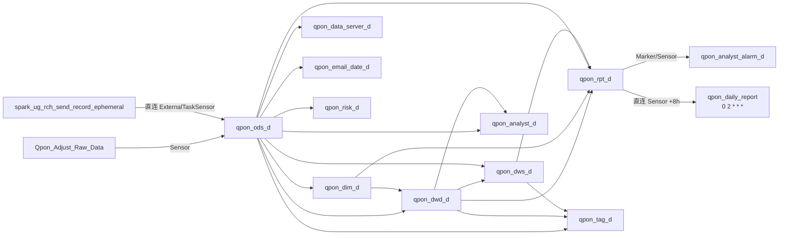
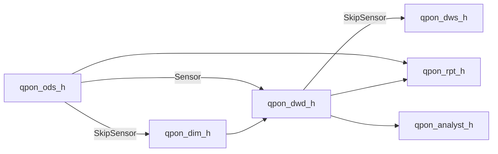

# 05_Business_Orchestration — qpon-bigdata

> 项目类型：NON_JAVA / Airflow DAG（Cloud Composer）  
> 扫描权威范围：`dags/`（含子目录）；禁止 `scripts/`  
> 语义映射：Java app RPC / service core 编排 → **DAG 入口依赖 + ExternalTaskSensor 跨 DAG 边 + `task >>` 层内边 + 分层管道 ods→dim/dwd→dws→rpt/tag**  
> BQ 锚点：`oppo-gcp-prod-digfood-129869` @ `asia-southeast2`  
> Legacy：NO_DOCS  
> 物理拦截：对 `dags/` 33 包入口做活工厂/Sensor/`>>` 全量计数；441 条 Sensor 边；订单状态以 ODS DDL 注释枚举为准；`digital_food_*` 仅源库/贴源路径，非仓内可写层

> [!SUCCESS] 业务编排全量测绘闭环验证
> - 扫描范围：DAG 入口实现 [36] 个 + 共享库/元数据子入口；等价 app/rpc=DAG 根文件，等价 service/core=tasks 包
> - RPC 入口映射：[36] 个 DAG 入口，活工厂≈BQ 任务槽按入口合计（Top：rpt_d/ods_d/tag_d/dwd_d）
> - 核心链路：[8] 条主链路完整还原至终端操作（BQ DELETE+INSERT / MERGE / ES / 飞书 / GenAI）
> - DDD 分层违规：[3] 处入口层业务/命名下沉 / [4] 处层依赖倒置或环状等待
> - 设计模式：识别 [5] 种模式的 [9] 个具体应用
> - 衍生约束：[8] 条（🔴 [5] 条强制 / 🟡 [3] 条建议）
> - 05_module_manifest.json：已生成，包含 [14] 个模块
> - 旧文档差异：N/A（NO_DOCS）
> - EOF 状态：已确认遍历至最后一行，无静默截断

---

### 1. RPC 入口映射表

N/A：无 Dubbo RPC 实现类。等价「RPC 入口」= **DAG 根文件**；「调用的 Service」= **`create_composer_*` / Sensor / 直连 Operator**。

| RPC 实现类（DAG 入口） | 接口方法（dag_id / schedule） | 调用的 Service 类.方法 | 分层评估 |
|---|---|---|---|
| `qpon_ods_d/qpon_ods_d.py` | `qpon_ods_d` / `0 18 * * *` | `create_composer_bq_task`×111；`create_composer_python_task`×16；`create_external_sensor`→`Qpon_Adjust_Raw_Data`；直连 `ExternalTaskSensor`→`spark_ug_rch_send_record_ephemeral`；`TimeDeltaSensor` | 入口仅编排；SQL/MERGE 在 tasks（合规） |
| `qpon_ods_h/qpon_ods_h.py` | `qpon_ods_h` / `10 * * * *` | BQ×38；Python×7；无跨 DAG Sensor（多为被等待方） | 合规 |
| `qpon_dim_d/qpon_dim_d.py` | `qpon_dim_d` / `0 18 * * *` | BQ×22；Sensor→`qpon_ods_d`×32 + 少量→`qpon_dwd_d`/`qpon_dws_d` | ⚠️存在 dim→dwd/dws 倒挂 Sensor |
| `qpon_dim_h/qpon_dim_h.py` | `qpon_dim_h` / `10 * * * *` | BQ×3；`create_external_task_skip_sensor_hour`×9→`qpon_ods_h` | 合规（小时 Skip 语义） |
| `qpon_dwd_d/qpon_dwd_d.py` | `qpon_dwd_d` / `0 18 * * *` | BQ×59；Python×1；Sensor×72（主→`qpon_ods_d`，次→`qpon_dim_d`/`qpon_dws_d`） | 枢纽；⚠️少量 dwd→dws |
| `qpon_dwd_h/qpon_dwd_h.py` | `qpon_dwd_h` / `10 * * * *` | BQ×15；Sensor×30→`qpon_ods_h`/`qpon_dim_h` | 合规 |
| `qpon_dws_d/qpon_dws_d.py` | `qpon_dws_d` / `0 18 * * *` | BQ×16；Sensor×23→`qpon_dwd_d`/`qpon_ods_d`/`qpon_dim_d` | 合规 |
| `qpon_dws_h/qpon_dws_h.py` | `qpon_dws_h` / `10 * * * *` | BQ×4；SkipSensor×8→`qpon_dwd_h`（含悬空 `check_allowed_hours_is_run`） | ⚠️悬空上游 |
| `qpon_rpt_d/qpon_rpt_d.py` | `qpon_rpt_d` / `0 18 * * *` | BQ×158；Python×14；Sensor×115；`create_external_marker`×2→alarm | 最大汇聚层；⚠️同 DAG Marker/互等 |
| `qpon_rpt_h/qpon_rpt_h.py` | `qpon_rpt_h` / `10 * * * *` | BQ×5；SkipSensor×16→`qpon_ods_h`/`qpon_dwd_h` | 合规 |
| `qpon_tag_d/qpon_tag_d.py` | `qpon_tag_d` / `0 18 * * *` | BQ×141；Sensor×23→ods/dwd/dws/dim/analyst | 标签扇出；合规为主 |
| `qpon_analyst_d` / `_h` | 日 `0 18` / 时 `10 *` | 日：BQ×23+Sensor×35；时：BQ×3+Skip×4 | 合规 |
| `qpon_analyst_alarm_{d,h}` | 日/时 | Python 告警 + Sensor→`qpon_rpt_d`/`qpon_analyst_h` | 合规 |
| `qpon_data_server_d` | `0 18 * * *` | BQ×10；Python×7（含 ES）；Sensor×22 | 出口服务；合规 |
| `qpon_email_date_d` | `0 18 * * *` | BQ×21；Sensor×14→ods/dim | 合规 |
| `qpon_risk_d` | `0 18 * * *` | BQ×47；Python×1；Sensor×10；Marker×1 | ⚠️跨多层（含 rpt） |
| `qpon_daily_report` | `0 2 * * *` | 直连 `ExternalTaskSensor`→`qpon_rpt_d.rpt_business_indicator_summary_d`；`PythonOperator` 链 | 合规（非工厂 Sensor） |
| `Qpon_Adjust_Raw_Data` | `0 18 * * *` | BQ 外部表 + Python | 被 ODS 等待 |
| `qpon_staging_d/spark_*` | `0 18 * * *` | Dataproc*Operator 链 | 运维/接入 |
| `qpon_search_d/…fea_export` | dag_id=`qpon_search_store_fea_export` / `0 18` | 自定义 Python+BQ；Sensor 参数 `dag_name="qpon_dwd_d"` | ⚠️入口命名/参数易混淆 |
| `qpon_metadata/*` | 分钟/日/自定义 | Pub/Sub、Datastream、Meta mixin | 横切元数据 |
| `data_options` / `task_kill` | 周五 / `*/2` | 清理/写 ES / 杀 BQ Job | 运维 |
| `*_test` 包族 | 同生产 cron | 镜像工厂+Sensor→`*_test` 上游 | 测试隔离包（勿与生产混调度） |

**工厂语义（app→service 第一跳）**：

```
[DAG入口].create_composer_bq_task(dag, warehouse_path, task_module_name)
  → [airflow_config] create_composer_bq_task.create_composer_bq_task()
  → importlib 加载 {warehouse_path}.{task_module_name}.{task_module_name}
  → BigQueryInsertJobOperator（终端：BQ Job）
```

---

### 2. 核心业务链路

#### 2.0 主链路编排图

**日批（`0 18 * * *`，Composer 时区以部署为准）**：



**小时批（`10 * * * *`）**：



**跨 DAG Sensor 依赖枢纽（按被等待次数 Top）**：

| 枢纽上游 | 被等次数量级 | 主要等待方 |
|---|---|---|
| `qpon_ods_d` | ~200+ 边汇入 | dwd_d / rpt_d / dim_d / analyst / data_server / email / tag / risk |
| `qpon_dwd_d` | ~50+ | rpt_d / dws_d / tag / analyst / data_server |
| `qpon_ods_h` | ~40+ | dwd_h / dim_h / rpt_h |
| `qpon_dim_d` | ~30+ | rpt_d / dwd_d / email / risk |
| `qpon_dws_d` | ~10+ | rpt_d / tag / risk |

**被等任务枢纽（单 task Top）**：`ods_t_life_product`(8)、`dim_daytime_info`(8)、`dim_store_info`(7)、`dwd_product_order_voucher_all`(6)、`dws_qpon_device_active_info_inc_d`(6)、`ods_t_life_order_all_d`/`voucher`/`coupon` 族(4–5)。

---

#### 2.1 订单宽表日批（枢纽链路）

```
[app] qpon_ods_d.start >> wait_1_hours
  → [app] wait_1_hours >> ods_t_life_order_all_d / item / voucher / coupon…
  → [core] ods_t_life_order_all_d() — MERGE 贴源（源 digital_food_market_*，非仓内可写层）
  → [infrastructure] BigQueryInsertJobOperator — ⚠️终端写 qpon_ods_d.*
[app] qpon_dwd_d.start >> [wait_ods_t_life_order_all_d, wait_ods_*voucher*, wait_dim_*, dwd_product_procurement_price_*]
  → [core] dwd_product_order_voucher_all() — DELETE+INSERT 分区重算；order_status 过滤 COMPLETED/RETURN（全集以 ODS 注释为准：SUBMIT/COMPLETED/CANCEL/RETURN）
  → [infrastructure] BQ Job — ⚠️终端写 qpon_dwd_d.dwd_product_order_voucher_all
[app] dwd_product_order_voucher_all >> dwd_product_finance_detail / dwd_product_consume_detail
  → [core] 下游明细 DELETE+INSERT
```

#### 2.2 Adjust 外部表 → ODS 增量

```
[app] Qpon_Adjust_Raw_Data — CREATE_EXTERNAL_TABLE_QponAdjust
  → [app] qpon_ods_d.wait_CREATE_EXTERNAL_TABLE_QponAdjust = create_external_sensor(…, "Qpon_Adjust_Raw_Data", "CREATE_EXTERNAL_TABLE_QponAdjust")
  → wait_1_hours >> wait_* >> ods_qpon_adjust_raw_data_inc_d
  → [core] ODS 增量任务 — BQ 写
```

#### 2.3 Spark UG 触达 → ODS

```
[app] spark_ug_rch_send_record_ephemeral（Dataproc 链）
  → [app] qpon_ods_d.wait_spark_ug_rch_send_record（直连 ExternalTaskSensor，非 create_external_sensor）
  → ods_ug_rch_send_record — BQ 终端写
```

#### 2.4 报表汇聚 + Marker 告警

```
[app] qpon_rpt_d.start >> wait_{ods|dwd|dim|dws}_* >> rpt_*
  → [core] rpt_* DELETE+INSERT / 部分 MERGE；ES 任务 access_cloud_run_write_aliyun_es
  → [infrastructure] BQ / Cloud Run ES
[app] create_external_marker → qpon_analyst_alarm_d.wait_rpt_bq_l0l1_*
  → [app] alarm DAG Sensor 成功后 Python 告警
```

#### 2.5 标签扇出

```
[app] qpon_tag_d.start >> wait_dws_qpon_device_active_info_* / wait_dwd_product_order_voucher_all / wait_ods_*
  → [core] tag_qpon_*_all_d — DELETE(dayno,tag_name)+INSERT；MERGE tag_qpon_metadata
  → 基表 >> Merchant_Active_{7,15,30…} 扇出任务
```

#### 2.6 小时批流量明细

```
[app] qpon_ods_h.* → 被 qpon_dwd_h Sensor 等待
  → [app] qpon_dwd_h.start >> dwd_qpon_event_traffic_inc_d >> dwd_*_card_view_click_* / place_order_source
  → [core] 写落点多为 qpon_dwd_d.*_h（日批 dataset）— DELETE+INSERT/MERGE
```

#### 2.7 日报 LLM（异步旁路）

```
[app] qpon_daily_report.wait_rpt_business_indicator_summary_d
  = ExternalTaskSensor(external_dag_id=qpon_rpt_d, task=rpt_business_indicator_summary_d, execution_delta=+8h)
  → query_metrics → compute_analysis → generate_narrative(google.genai) → send_feishu
```

#### 2.8 数据服务 ES 出口

```
[app] qpon_data_server_d.start >> wait_ods_* / wait_dwd_* / wait_dim_*
  → [core] *_to_es Python — access_cloud_run_write_aliyun_es / delete_by_field_condition
  → [infrastructure] Cloud Run → 阿里云 ES
```

---

### 3. DDD 分层审计汇总

语义映射：app=DAG 入口；core=tasks SQL/Python；infrastructure=`airflow_config` + 外部 Operator。

**app 层下沉清单**：

| 位置 | 行为 | 判定 |
|---|---|---|
| `qpon_search_d/…fea_export.py` | Sensor 参数写死 `dag_name="qpon_dwd_d"`，与本文件 dag_id `qpon_search_store_fea_export` 不一致 | ⚠️命名/契约下沉风险 |
| 多入口内嵌 `TimeDeltaSensor`/`ShortCircuit` | 调度等待策略写在入口 | 可接受（Airflow 惯例）；非业务 SQL |
| `qpon_daily_report` 入口内联 `_task_*` | 编排函数定义在入口文件 | 轻度下沉；核心仍在 `tasks/` |

**infrastructure 侵入清单**：

| 位置 | 行为 |
|---|---|
| `airflow_config` | 未反向 import 业务 tasks（保持工厂纯净）— ✅ |
| Sensor 默认 `retries=1000` | 基础设施策略覆盖 DAG retries — 运维侵入调度语义 |
| 层倒挂边 | `qpon_dim_d`→`qpon_dwd_d`(3)、`qpon_dwd_d`→`qpon_dws_d`(2)、`qpon_rpt_d` 自等/Marker — 调度图打破分层 |

**分层总体评估**：tasks 层承载领域 SQL，工厂库保持无业务表知识；主要腐化在 **跨层 Sensor 边** 与 **测试/生产同仓同 cron**，而非 Java 式 DAO 穿透。

---

### 4. 设计模式识别

| 模式 | 类/函数 | 场景 |
|---|---|---|
| 工厂 | `create_composer_bq_task` / `create_composer_python_task` / `Check_BQ_Data_IsExists_Operator` | 统一注册 BQ/Python 任务，task_id=模块 stem |
| 工厂 | `create_external_sensor` / `create_external_task_skip_sensor_hour` | 跨 DAG 等待边标准化 |
| 模板方法 | 各 `tasks/*.py` 导出名 + SQL 字符串约定 | DELETE+INSERT / MERGE / TRUNCATE 骨架重复 |
| 策略 | `ExternalTaskSensor` vs `ExternalTaskSkipSensor.poke` | 日批失败即失败 vs 小时批透传 skipped |
| 标记/观察 | `create_external_marker` + alarm Sensor | rpt 完成反向通知告警 DAG |
| 哑元编排 | `DummyOperator` `start` / `start_new_task` | 扇出依赖根 |

---

### 5. 衍生约束清单

| 约束编号 | 约束内容（一句话，可执行） | 代码证据 | 严重级别 |
|---|---|---|---|
| C-05-01 | 分区事实表变更必须走 DELETE+INSERT（或同文件已有 MERGE），禁止无分区键全表覆盖误写 | `dwd_product_order_voucher_all`；tag `DELETE … dayno` | 🔴 |
| C-05-02 | 贴源 ODS 追踪源库用 MERGE；禁止把 `digital_food_*` dataset 当仓内可写目标层 | `ods_t_life_order_all_d` MERGE；FQN 源 `digital_food_market*` | 🔴 |
| C-05-03 | 订单状态枚举以 ODS 注释为准：`SUBMIT`/`COMPLETED`/`CANCEL`/`RETURN`；下游过滤不得发明新状态字面量 | `ods_t_life_order_all_d.py` DDL 注释 | 🔴 |
| C-05-04 | 新增跨 DAG 依赖必须经 `create_external_sensor*`（或文档化的直连 Sensor），upstream 必须是真实 dag_id+task_id | `create_external_sensor`；对比悬空 `check_allowed_hours_is_run` | 🔴 |
| C-05-05 | 禁止新增 dim→dwd、dwd→dws、下层等上层的层倒挂 Sensor，除非附兼容说明 | `qpon_dim_d`→`qpon_dwd_d`；`qpon_dwd_d`→`qpon_dws_d` | 🔴 |
| C-05-06 | 测试包 `*_test` 只等待 `*_test` 上游，禁止 Sensor 指向生产 dag 写测试表 | `qpon_email_date_d_test`→`qpon_ods_d_test` | 🟡 |
| C-05-07 | 小时批优先 SkipSensor；勿对小时链路误用日批 `retries=1000` 工厂 | `create_external_task_skip_sensor_hour` vs `create_external_sensor` | 🟡 |
| C-05-08 | 改调度边须同步更新本知识库 §2 图与 manifest 模块边界 | 军规双写；入口 `>>` / Sensor | 🟡 |

---

### 6. 旧文档交叉验证摘要

NO_DOCS：`Legacy_qpon-bigdata_Claims.md` 无业务链路声称，本节跳过。

---

## 附录 A：模块分册（对应 `05_module_manifest.json`）

### A.1 `airflow-config` — 共享编排工厂与告警
- 入口：非独立 DAG；被全仓 import
- 核心：`create_composer_*`、`create_external_sensor*`、`TtSend`、`access_cloud_run_write_aliyun_es`、`ReadFeiShuToBigQuery`
- 上下游：上游=无；下游=所有业务 DAG

### A.2 `ods-d` — ODS 日批
- 入口：`qpon_ods_d/qpon_ods_d.py`
- 核心 tasks：`ods_t_life_order_all_d`、voucher/coupon/settle/adjust/feishu 活任务；`TimeDeltaSensor` 门控
- 上下游：上游 Adjust/Spark；下游几乎所有日批 DAG

### A.3 `ods-h` — ODS 小时批
- 入口：`qpon_ods_h/qpon_ods_h.py`
- 核心：事件/消息等小时贴源（写常落 `qpon_ods_d` dataset）
- 上下游：下游 dim_h/dwd_h/rpt_h

### A.4 `dim-d` — DIM 日时批
- 入口：`qpon_dim_d` + `qpon_dim_h`
- 核心：`dim_store_info`、`dim_merchant_basic_info`、`dim_daytime_info`、`dim_product_basic_info`
- 上下游：上游 ods；下游 dwd/rpt/tag/email/risk

### A.5 `dwd-d` — DWD 日批
- 入口：`qpon_dwd_d/qpon_dwd_d.py`
- 核心：`dwd_product_order_voucher_all` 及 finance/consume 扇出；流量/门店明细
- 上下游：上游 ods+dim；下游 dws/rpt/tag/analyst/data_server

### A.6 `dwd-h` — DWD 小时批
- 入口：`qpon_dwd_h/qpon_dwd_h.py`
- 核心：`dwd_qpon_event_traffic_inc_d` 及点击/下单衍生
- 上下游：上游 ods_h/dim_h；下游 dws_h/rpt_h/analyst_h

### A.7 `dws-d` — DWS 日时批
- 入口：`qpon_dws_d` + `qpon_dws_h`
- 核心：`dws_qpon_device_active_info_inc_d` / `*_all_d`；小时 feature
- 上下游：上游 dwd(+ods/dim)；下游 rpt/tag/risk

### A.8 `rpt-d` — RPT 日批
- 入口：`qpon_rpt_d/qpon_rpt_d.py`
- 核心：业务指标明细/汇总、渠道/部门看板、ES 导出、`create_external_marker`
- 上下游：上游 ods/dim/dwd/dws；下游 alarm、daily_report、部分 risk/tag

### A.9 `rpt-h` — RPT 小时批
- 入口：`qpon_rpt_h/qpon_rpt_h.py`
- 核心：少量 `rpt_*_h`；SkipSensor 等待小时上游
- 上下游：ods_h/dwd_h

### A.10 `tag-d` — 标签
- 入口：`qpon_tag_d/qpon_tag_d.py`（test 见 test-dags）
- 核心：`tag_qpon_*_all_d` + 活跃天数扇出；写 `qpon_services_prod`
- 上下游：ods/dwd/dws/dim/analyst

### A.11 `analyst-serving` — 分析/服务/风控/日报
- 入口：`qpon_analyst_*`、`qpon_data_server_*`、`qpon_email_date_*`、`qpon_risk_d`、`qpon_daily_report`、`qpon_search_d`
- 核心：ADS 指标、ES 服务、邮件日期维、风控特征、LLM 日报、搜索特征导出
- 上下游：主仓数仓层；出口 ES/飞书/告警

### A.12 `metadata` — 元数据与监控
- 入口：`gcp_monitoring_alert`、`sync_source_meta`、`sync_bigquery_staging_description`
- 核心：Pub/Sub Incident、Datastream/MySQL meta、staging 描述同步
- 上下游：GCP API；与主 ETL 弱耦合

### A.13 `ops-staging` — 运维与接入
- 入口：`data_options`、`task_kill`、`qpon_staging_d/spark_*`、`Qpon_Adjust_Raw_Data`
- 核心：清理/导出/杀 Job、Dataproc、Adjust 外部表
- 上下游：被 ODS Sensor 消费；运维人工触发面

### A.14 `test-dags` — 测试包
- 入口：`qpon_ods_d_test`、`qpon_dwd_d_test`、`qpon_tag_d_test`、`qpon_data_server_d_test`、`qpon_email_date_d_test`、`qpon_review_score_test`、`qpon_test_d`
- 核心：生产镜像子集；Sensor 应指向 test 上游
- 上下游：仅测试环境数据集（`qpon_services_test` 等）

---

> [!RELAY] 定向审计约束
> - **物理事实 (Context)**: 日批主链靠 ExternalTaskSensor（441）串层；ODS 订单/券 MERGE 贴源，DWD/RPT/TAG 以 DELETE+INSERT 分区重算为主；小时批大量 SkipSensor；`qpon_daily_report` 以直连 Sensor+`execution_delta=8h` 等 `qpon_rpt_d`；Spark/Adjust 以直连或工厂 Sensor 注入 ODS；ES/飞书/GenAI 为 Python 终端旁路。
> - **推演约束 (Constraint)**: Step 06 必须审计 (1) Sensor retries=1000 / SkipSensor 与失败补偿；(2) `qpon_daily_report` 跨调度偏移异步；(3) Dataproc spark 与 ODS 直连 Sensor；(4) Cloud Run ES 写失败重试与幂等；(5) 悬空上游 `check_allowed_hours_is_run`；(6) TT `on_failure_callback` 是否掩盖真实失败。
> - **物理锚点 (Anchors)**: `dags/airflow_config/create_external_sensor.py` L10-24；`dags/qpon_ods_d/qpon_ods_d.py` L127-137 / L184 / L713；`dags/qpon_dwd_d/qpon_dwd_d.py` L710-728；`dags/qpon_daily_report/qpon_daily_report.py` L143-186；`dags/qpon_rpt_d/qpon_rpt_d.py` L552-553；`dags/qpon_dws_h` SkipSensor→`check_allowed_hours_is_run`。
