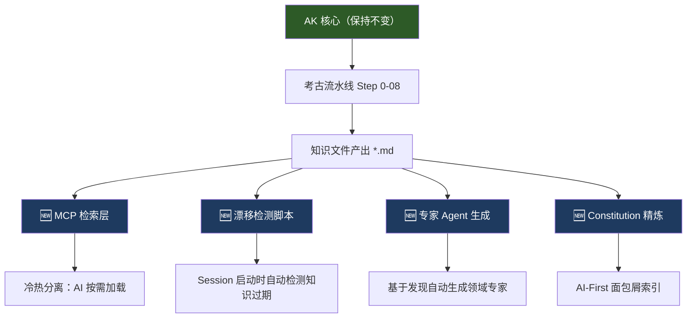

# AK vs CC 深度对比分析：提取设计精华，强化知识考古

> **AK** = `ai-knowledge`（知识库考古流水线）
> **CC** = `codified-context-infrastructure`（Codified Context，arXiv:2602.20478）

---

## 一、本质定位差异

| 维度 | AK（我们） | CC（对方） |
|:---|:---|:---|
| **核心隐喻** | 考古学家：从"废墟"中挖掘真相 | 图书馆架构师：为读者设计高效的藏书体系 |
| **解决的核心痛点** | 知识**从哪来**——接手屎山项目时如何自动提取隐含知识 | 知识**怎么找**——当知识已存在时如何让 AI 高效定位 |
| **知识生命周期** | 覆盖 **生产 → 校验 → 保活** 全链路 | 聚焦 **组织 → 检索 → 路由** |
| **假设前提** | 假设项目文档**不存在或不可信**，必须从代码事实中提炼 | 假设**有人维护文档**（人或 Factory Agent 辅助） |
| **学术定位** | 工程实践驱动的工具项目 | 有 arXiv 论文支撑的架构理论 |

> [!IMPORTANT]
> **关键洞察**：两者并非竞品关系，而是**互补关系**。AK 解决的是知识的"创世纪"问题，CC 解决的是知识创世后的"文明治理"问题。最强方案 = AK 生产知识 + CC 的架构来管理和检索知识。

---

## 二、7 维度深度对比

### 2.1 知识获取方式

| | AK | CC |
|:---|:---|:---|
| **自动化程度** | ⭐⭐⭐⭐⭐ 全自动：11 步流水线从代码中挖掘 | ⭐⭐⭐ 半自动：Factory Agent 问 3 个问题后生成 |
| **交叉验证** | ✅ Step 0 提取旧文档声称 → 后续步骤逐一用代码对照 | ❌ 无内置验证机制，依赖人工审核 |
| **幻觉防御** | ✅ 物理隔离 + `[!SUCCESS]` 门禁 + 认知接力 | ❌ 单次会话生成，无系统性防幻觉措施 |
| **适用场景** | 接手完全陌生的项目、屎山、旧项目 | 从 Day 1 就持续维护的新项目 |

> [!TIP]
> **我们的优势是碾压级的**：CC 的 Factory Agent 本质上是「问你 3 个问题，然后用你的答案生成文档」，信息源是**人类口述**。AK 的信息源是**代码事实**，且经过 8+ 步交叉验证。这是"传闻" vs "物证"的差距。

### 2.2 知识存储与分层架构

| 维度 | AK（我们） | CC（对方） |
|:---|:---|:---|
| **层级深度** | **扁平化多级索引**：Rules(热) → 00 Index(温) → 08x Subsystem(冷) | **三层物理分离**：Constitution(热) → Agents(温) → Knowledge Base(冷) |
| **加载机制** | **按需加载 + 确定性路径**：Rules 引导 AI 物理读取 MD 文件 | **按需加载 + 概率检索**：通过 MCP 工具实现文件检索与拉取 |
| **Context 连续性**| ✅ **极高**：AI 拥有完整文件上下文，逻辑推导无断链 | ⚠️ **一般**：检索过程可能丢失跨文件细节，导致局部逻辑过拟合 |
| **Token 效率** | ⚠️ 依赖 AI 纪律：若无预热，模型需不断调用读文件工具 | ✅ 精准加载：通过检索仅获取任务高度相关的片段 |
| **系统复杂度** | 🟢 **基效统一 (KISS)**：无需额外基建，利用 Rules 机制即可扩展 | 🔴 **架构过载**：需额外维护 Python/TypeScrpit 的 MCP Server |

> [!IMPORTANT]
> **深度辩证：物理分离 vs 语义索引**
> CC 的架构优势主要建立在“Token 极其昂贵且窗口狭窄”的陈旧前提上。
> AK 产出的 01-08 号文件本就是**高熵、高信息密度**的浓缩知识，全量体积极小（通常 < 50k Token）。
> 在 SOTA 模型场景下，AK 的方案（规则索引+确定性读取）避开了 RAG 检索的概率损耗。**我们不需要 CC 的三层架构来“节省空间”，而应该借鉴其“意图路由”的精确度来“指导加载”。**

### 2.3 知识检索与路由

| 维度 | AK（我们） | CC（对方） |
|:---|:---|:---|
| **引导逻辑** | 🧭 **确定性场景路由**：基于场景（排障/新增接口）的专家地图 | 🔍 **工具化模糊检索**：基于关键词匹配的资源寻址 |
| **检索效率** | ✅ **零冷启动延迟**：Rules 瞬时决策，直接指向目标文件 | ⚠️ **多跳决策**：需调用 MCP Tool -> 等待搜索结果 -> 二次决策 |
| **检索精度** | ✅ **逻辑关联性**：场景级强绑定（如排障必读 06/07），防漏读痕迹 | ⚠️ **关键词孤岛**：若代码注释不足，仅靠 keywords 极易错过隐性关联 |
| **工具依赖** | **原生主义 (Native)**：利用 IDE 已有的 `grep/read` 工具即可完成 | **基建依赖**：强依赖自定义 MCP Tool 的稳定性与检索策略 |

> [!IMPORTANT]
> **深度辩证：路由 (Routing) vs 搜索 (Search)**
> CC 的检索机制本质上是在知识库中安装了一个“百度/谷歌”；而 AK 则是提供了一份“专家地图”。
> 
> **AK 的优势实现：**
> 1. **场景化降维**：通过 `00_Master_Catalog` 中的表格，将模糊的意图（“我要修个 Bug”）转化为确定的文件组合（“读 07 配置 -> 读 03 依赖”）。
> 2. **贪婪上下文加载**：与其让 AI 每次去“搜”，不如直接告诉它“针对这个场景，这 3 个文件你必须一口气读完”。这能够极大地提升模型分析复杂链路的一致性。
> 
> **结论**：在考古知识库这种规模下，**“导航”比“搜索”更重要**。

### 2.4 知识保活（Anti-Drift）机制

| 维度 | AK（我们） | CC（对方） |
|:---|:---|:---|
| **核心哲学** | 🛡️ **协议内生防御 (Proactive)**：保活逻辑植入开发军规，实时维护逻辑一致性 | 🚨 **响应式审计 (Reactive)**：假设 AI 会遗漏更新，通过外部脚本事后查漏补缺 |
| **保活精度** | ✅ **逻辑级深度关联**：AI 在修改代码的同时审视知识库，确保隐性漏洞被记录 | ⚠️ **物理级粗粒度扫描**：仅能检测“改了 A 但没动 B”这种表面耦合，易漏掉逻辑漂移 |
| **感知时机** | **开发中 (In-dev)**：变更发生即记录，无滞后 | **启动阶段 (Session Start)**：滞后到下一次会话启动时才预警 |
| **硬化方向** | 🏗️ **确定性 Hook 守护**：未来拟通过 git-hook / IDE-hook 强制拦截未履行协议的变更 | ✅ **自动化脚本套件**：已提供基于 Python 的 drift-check 脚本与自动消除逻辑 |

> [!IMPORTANT]
> **深度辩证：主动契约 vs 事后检测**
> CC 的 `drift-check.py` 确实是一个精巧的“烟雾报警器”，非常适合缓解 AI 的**任务短路径惯性（偷懒）**。
> 
> **AK 的强化路径：**
> 1. **协议硬化**：AK 的优势在于“双写协议”是军规级别的硬约束。后续应在流水线中配套生成一个 `pre-commit-hook` 或 `audit-check.sh`，在物理层面强制核查 AI 输出中是否包含了对应的知识库 Diff。
> 2. **拒绝盲目响应**：不应该神化事后的 log 扫描，而应该通过 **“高强度规则提示（Rule Prompts） + 物理 Hook 拦截”** 构建一套闭环的保活机制。

### 2.5 Agent 专业化

| | AK | CC |
|:---|:---|:---|
| **执行 Agent 角色** | 通才：每步用同一个通用 Agent（只靠 Prompt 模板引导方向） | 专家：16 个专门化 Agent（代码评审、坐标系、网络协议、能力设计…） |
| **Agent 路由** | ❌ 指挥官决定步骤顺序，无 Agent 选择 | ✅ Trigger Table 自动路由 + `suggest_agent()` MCP 工具 |
| **模型选择** | 统一使用 gemini-3.1-pro-preview | 分级：复杂判断用 opus，模式匹配用 sonnet |
| **Agent 规范** | 无独立 Agent 规范文件 | 每个 Agent 有独立的 AGENT.md（含领域知识、代码模式、反模式） |

### 2.6 操作体验与 Bootstrapping

| | AK | CC |
|:---|:---|:---|
| **初始化** | `install.sh` → `gemini --yolo` → "运行考古流水线 旧文档=无" | 复制 3 个 Factory Agent → "帮我设置 codified context infrastructure" |
| **引导方式** | 全自动，用户等结果（约 14 步 × ~10 分钟/步 ≈ 2-3 小时） | 对话式，每个 Factory 问 3 个问题 → 生成对应产物 |
| **渐进策略** | 一次性全量生成（贪吃蛇从头吃到尾） | 渐进式：Day 1 宪法 → Week 1 MCP → Week 1-2 首批 Agent → 持续 |
| **多项目适配** | ✅ Step 05 ManifestJSON 驱动动态拓扑，零配置适配 | ✅ Factory Agent 根据问答自适应 |

### 2.7 工程成熟度

| | AK | CC |
|:---|:---|:---|
| **测试** | ✅ TDD 测试套件（R1-R15） | ❌ 无测试套件 |
| **日志** | ✅ 三层日志（pipeline + step + heartbeat） | ❌ 无结构化日志 |
| **续跑** | ✅ Session resume（Gemini CLI 原生） | ❌ 无断点续跑 |
| **双端兼容** | ✅ Cursor + Gemini CLI 双版本 | ⚠️ Claude Code 优先，其他工具需手动适配 |
| **arXiv 论文** | ❌ 无 | ✅ 有学术引用 |

---

## 三、CC 中可吸收的 5 项设计亮点

### 🔥 亮点 1：MCP 检索层（Cold Memory Retrieval）

**CC 的做法**：
```python
# 7 个 MCP Tool
list_subsystems()              # 列出所有子系统
get_files_for_subsystem("ecs") # 获取子系统的关键文件
find_relevant_context("添加敌人") # 按任务描述找相关文件
search_context_documents("BSP")  # 跨文档全文搜索
suggest_agent("修 camera 偏移")   # 推荐最佳 Agent
list_agents()                     # 列出所有专家 Agent
get_context_files()               # 列出所有知识库文档
```

**核心机制**：
- 在 `server.py` 中维护一个 `SUBSYSTEMS` 字典，每个子系统包含 `name`、`description`、`keywords`、`files` 四个字段
- AI 通过关键词匹配找到相关子系统，然后按需读取对应的 `.claude/context/*.md` 文件
- 这实现了"只在需要时加载深度文档"的效果，避免 Token 浪费

**AK 如何吸收**：
- 在 `step-final-assembly` 阶段额外生成一个 `mcp-server/server.py`，基于 `05_module_manifest.json` 自动构建 SUBSYSTEMS 字典
- 每个模块的 `08_Module_*.md` 成为冷存储文档，通过 MCP 按需检索
- `00_Master_Catalog.md` 精简为 Constitution（热存储），只保留 200-400 行的索引和路由规则

---

### 🔥 亮点 2：上下文漂移检测 (`context-drift-check.py`)

**CC 的做法**：
```python
# 核心逻辑
def detect_code_doc_drift(repo_root, subsystems):
    # 1. git log 提取最近 10 个 commit 的变更文件
    # 2. 分离代码文件和文档文件
    # 3. 对每个子系统：如果代码改了但文档没更新 → 标记漂移
    # 4. 按 HIGH/MEDIUM/LOW 优先级分级输出
```

- 挂载在 Session Start hook 上，每次启动 AI 会话时自动运行
- HIGH 优先级：AI 会话开始时自动更新文档再做其他事
- MEDIUM 优先级：提醒用户，询问是否处理
- 自动消除：同一警告展示 2 次后抑制；文档更新后清除

**AK 如何吸收**：
- 在 `step-final-assembly` 阶段生成 `drift-check.sh`（Bash 版，不依赖 Python）
- 从 `05_module_manifest.json` 读取子系统→文件映射关系
- 安装到 `.gemini/hooks/session-start` 或作为 Rule 的前置检查
- 漂移报告注入 `00_Master_Catalog.md` 的头部作为警告

---

### 🔥 亮点 3：专家 Agent 分化与触发路由表

**CC 的做法**：

CLAUDE.md 中的触发表是最精巧的设计之一：

```markdown
| 如果你正在触碰或研究... | 调用 Agent |
|---|---|
| 复杂代码、嵌套条件、长方法 | code-simplifier |
| 坐标系、WorldToScreen、camera | coordinate-wizard |
| 新 ECS 组件或系统 | ecs-component-designer |
```

每个 Agent 的 AGENT.md 包含：
- 模式切换（EXPLORE 只读 / IMPLEMENT 读写）
- 嵌入的领域专业知识（代码模式、反模式、检查清单）
- 模型选择建议（opus / sonnet）
- 与 MCP Server 的集成指令

**AK 如何吸收**：
- 在 `step-final-assembly` 阶段，基于流水线已发现的项目特征，自动生成 2-3 个初始专家 Agent
- 例如：如果 Step 06 发现了 MQ 和分布式锁 → 自动生成带领域知识的「异步基础设施专家」Agent
- 如果 Step 02 发现了 Dubbo/gRPC 契约 → 自动生成「API 契约守卫」Agent
- Agent 规范文件存入 `.gemini/agents/` 或 `.cursor/agents/`

---

### 🔥 亮点 4：Constitution 的极致信息密度

**CC 的 CLAUDE.md**（660 行）是一个教科书级的 Constitution 设计：

```
结构设计亮点：
├── 技术栈声明（3 行）
├── 代码质量标准（5 行）
├── 项目结构（10 行）
├── 每个子系统的"面包屑"摘要（5-10 行/子系统，含指向冷存储的引用）
├── MCP 工具速查表（7 行）
├── Agent 触发表 + Post-Change 触发表（30 行）
├── 关键文件参考映射（20 行）
└── Post-Feature 检查清单（10 行）
```

**核心技巧**：
- 每个子系统只给 5-10 行"面包屑"（如 Turbo System 只给公式和系统优先级），详细内容指向 `.claude/context/*.md`
- 大量使用表格（AI 解析表格比散文更快更准确）
- "Written for AI, not humans"——格式优先适合机器解析

**AK 如何吸收**：
- 当前 `00_Master_Catalog.md` 偏向"人类可读"的目录索引
- 应该增加一个"AI-First"变体：`{project_name}.md` 规则文件中压缩每个模块为 5-10 行面包屑
- 面包屑内容从各步骤的 `[!SUCCESS]` 摘要中自动提炼（指挥官已经有这些摘要了）
- 在 `step-final-assembly` 的规则文件生成逻辑中实现

---

### 🔥 亮点 5：渐进式增长策略

**CC 的 Growth Pattern**：

| 阶段 | 创建什么 | 何时 |
|---|---|---|
| Day 1 | 仅 Constitution | 项目启动 |
| Week 1 | MCP Server | 有足够代码可索引时 |
| Week 1-2 | 首批 1-2 个 Agent | 发现 AI 反复犯同类错误时 |
| Week 2-4 | 首批 3-5 个 context docs | 子系统复杂到需要独立文档时 |
| 持续 | 按需新增 | 新领域出现或失败模式重复时 |

知识与代码的比例从 ~10% 增长到 ~20-25%（论文案例达到 24%）。

**AK 如何吸收**：
- 当前 AK 是"一次全量生产"模式，这对接手旧项目是正确的
- 但产出后，应该提供"增量维护"的指引和工具
- 在产出的规则文件中增加 Growth Guidance 章节，告知用户"何时该新增 Agent"和"何时该拆分模块文档"

---

## 四、AK 强化行动方案



### 优先级排序

| 序号 | 强化项 | 改动范围 | 收益 | 建议优先级 |
|:---|:---|:---|:---|:---|
| 1 | **MCP 检索层** | 新增 `step-final-assembly` 产出 + MCP server 模板 | Token 效率质变 | 🔴 P0 |
| 2 | **漂移检测脚本** | 新增独立脚本 + install.sh 挂载 | 知识保活从"靠自觉"变成"有工具" | 🟡 P1 |
| 3 | **Constitution 精炼** | 修改 `step-final-assembly` 模板 | 热加载层更轻量、AI 解析更快 | 🟡 P1 |
| 4 | **专家 Agent 生成** | 新增 `step-final-assembly` 产出 | 使用阶段的 AI 专业度提升 | 🟢 P2 |
| 5 | **增量维护指引** | 在产出文件中增加 Growth 章节 | 用户后续知道怎么维护 | 🟢 P2 |

---

## 五、总结：两个项目的互补拼图

```
         知识生命周期
    ┌────────────────────────────────────────────────────┐
    │  创世纪          治理期          保活期            │
    │                                                    │
    │  ┌──────────┐   ┌───────────┐   ┌──────────────┐  │
    │  │  AK 主场  │   │  CC 主场   │   │  二者融合主场 │  │
    │  │          │   │           │   │              │  │
    │  │ 自动挖掘  │   │ 冷热分层   │   │ 漂移检测     │  │
    │  │ 交叉验证  │   │ MCP 检索   │   │ 双写协议     │  │
    │  │ 物理隔离  │   │ Agent 专家  │   │ 增量更新     │  │
    │  │ 贪吃蛇链  │   │ Trigger 路由│   │              │  │
    │  └──────────┘   └───────────┘   └──────────────┘  │
    └────────────────────────────────────────────────────┘
```

> [!NOTE]
> **最终结论**：AK 在知识生产的**自动化程度**和**证据可信度**上处于绝对领先；CC 在知识使用阶段的**Token 效率**和**检索智能**上更为成熟。强化方向明确：**保持 AK 的考古暴力美学不变，在产出端嫁接 CC 的检索基建和漂移检测能力**。
